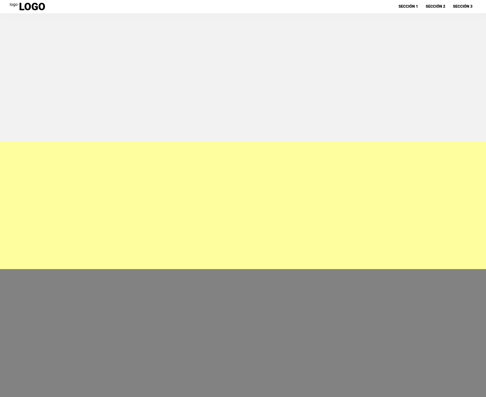

# 🚀 basic-landingpage

>See the branch for more details

## 1.0 Version

- index.html
- style.css
- index.js

### index.html

In this case, use basic template:

- Use article, sections and nav tags for CEO in this page.
- Don't use style inline
- Use alt attribute for standar inclusive peoples

> 💡 Use span and not div for elements with need default display inline style

### style.css

For css use this characteristics:

- B.E.M. for nomenclature
- Responsive design, use mediaqueries ( 768px or less for tables and phones, 768px and more for pc )
- CSS variables
- Dont use position absolute
- Smooth scroll is a beautiful animation

> 💡 Use position sticky for nav and dont use position fixed

### index.js

Create one js for animation nav bar

- Use onclick events
- Add and remove class of DOM elements with classList property

> 💡 Use getElementId and donde querySelector for more speed and performace in DOM

